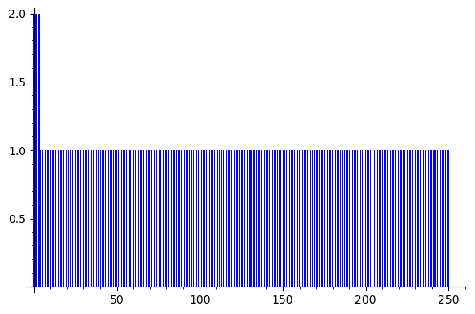

# Week 2 lab


### Exercise 1

Consider S the set of integers in the range 0..250 and note p = 251 is a prime number. Take C to be the set of
all bit strings of length 8. Let the distribution D to be defined by the function D(C) := C (mod p), i.e. takes the
remainder of coins C divided by p.

### 1.1 Compute the probability that each value in S is produced by D.

``S = [0 .. 250]
p = 251
C = 2 ^ 8 (bit) ``

```
import collections

p = 251

remainders = []

for x in range(0, 255):
    remainder = x % 251
    remainders.append(remainder)
    
counter = collections.Counter(remainders)

## Distribution
display(bar_chart([counter[c] for c in range(0,256)]))

```



After running the previous function, we realize that the distribution is not uniform because there are values with greater probability than others.

### 2. Repeat question #1 but take p = 28, i.e., a power of 2.

It will be uniform , given that p is a power of 2.


### 3. Use Sage to compute the entropy of the two distributions referred in questions #1 and #2. Compute also the entropy of the uniform distribution over S.

Given the entropy formula presented in the document, we can infer the following formula.

```
## This function calculates the entropy of a given dist
def calc_entropy(dist):
    total = 0
    for (_,value) in dist.items():
        total += (-1) * value * float(log(value,2))
    return total

## The function distribution is given above
print("Entropy 1 = " + calc_entropy(distribution(2**8 -1,251)))
print("Entropy 2 = " + calc_entropy(distribution(2**64 -1,251)))
```

### 4. Generalize the computations from question #3 in Sage to compute the entropy of distribution D when C is the set of bit strings of length k. Check (approximately) what is the smallest k for which the entropy computed in Sage for D matches the entropy of the uniform distribution over S

### 5. hexdump can be used to extract randomness from /dev/urandom. Explain what the following command is doing.

``$ hexdump -n 32 -e '1/4 "%0X" 1 "\n"' /dev/urandom!!``

### Implement an alternative command that uses /dev/urandom to create a file with random bytes.

Hexdump commands convert inputs (such as strings and files) into predetermined formats. The size of the input to be taken into account may be specified using the ``-n`` option (the first n bytes of the input), and the output format can be specified using the option ``-e``. In essence, the program converts the first 32 bytes into hexadecimal format using the bitstrings provided by the operating system's PRG found in the /dev/urandom file as input.

Other alternative:
```
dd if=/dev/urandom of=<INPUT> count=<BYTES> openssl rand <BYTES> -out <OUTPUT>
```

### 6. Use openSSL to generate a key pair where private key is protected with a password.
``openssl genrsa 4096``

### 6.1 See what happens when you increase/decrease the key size.

The time to compute increases/decreases according to the size of the key. Also , it needs to be >=128 bits , otherwise it will crash.

### 6.2 Investigate how openSSL converts the passphrase into a cryptography key for encryption/wrapping.

AES + password (as secret key)


### 7. Use openSSL to generate random Diffie-Hellman parameters.

``openssl gendh 2048``

### See what happens when you increase/decrease the key size. Compare to the previous case.

As the key size increases so the time to generate the parameters. This one takes longer that the previous one because it is necessary to find a prime value with the specified bit size.
